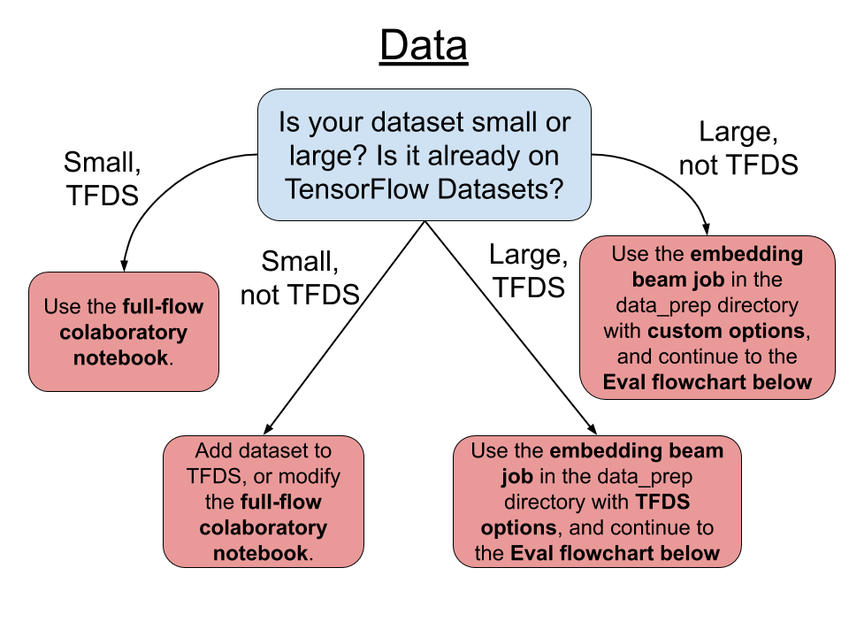

# Towards Learning a Universal Non-Semantic Representation of Speech

Paper: [Towards Learning a Universal Non-Semantic Representation of Speech](https://arxiv.org/abs/2002.12764)

## Things you can do

1. Reproduce the results from our [paper](https://arxiv.org/abs/2002.12764)
1. Compute performance of a new embedding on the Non-semantic Speech
   Benchmark (NOSS)
1. Run our embedding (TRILL), or any of the other embedding networks on a new
   dataset.

## Citation
To use this benchmark or embeddings, please cite as follows:

```
@article{shor2020,
    title={Towards Learning a Universal Non-Semantic Representation of Speech},
    author={Joel Shor and Aren Jansen and Ronnie Maor and Oran Lang and Omry Tuval and Felix de Chaumont Quitry and Marco Tagliasacchi and Ira Shavitt and Dotan Emanuel and Yinnon Haviv},
    year={2020},
    journal = {ArXiv e-prints},
    eprint={2002.12764},
    archivePrefix={arXiv},
    primaryClass={eess.AS},
    url = {https://arxiv.org/abs/2002.12764}
}
```

## Overview

{width="500"}

{width="400"} {width="400"}


## Detailed Instructions

### Full-flow colaboratory notebook

Use `non_semantic_speech_benchmark/train_and_eval_sklearn_small_TFDS_dataset.ipynb`.

### Embedding data prep beam job, TFDS dataset

Use `non_semantic_speech_benchmark/data_prep/audio_to_embeddings_beam_main.py`
with `tfds_dataset`.

### Embedding data prep beam job, custom dataset

Use `non_semantic_speech_benchmark/data_prep/audio_to_embeddings_beam_main.py`
with `input_glob`.
